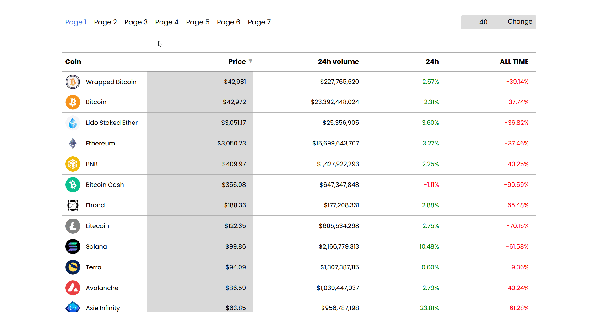

# Copy Coingecko

The React App, which represent the copy of <a href="https://www.coingecko.com">coingecko</a>. 
In this project was used library ChartJS to make a cryptocurrency/usd chart. 
It helps to follow cryptocurrency & to find all needed information about the certain coin. 
Also, you can sort cryptocoins by different parameters.

Demo: <a href="https://adoring-thompson-88153a.netlify.app/">Coingecko Copy</a>
